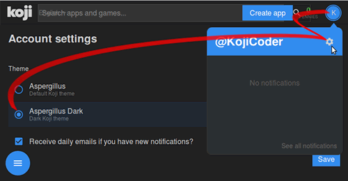
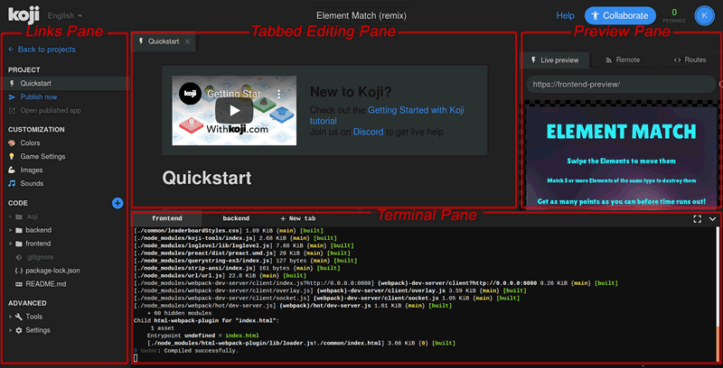
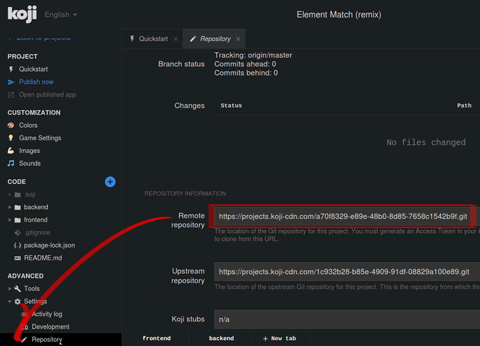
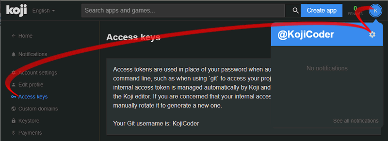
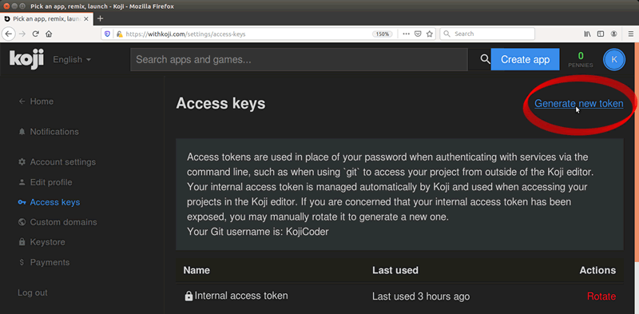
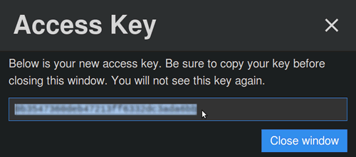
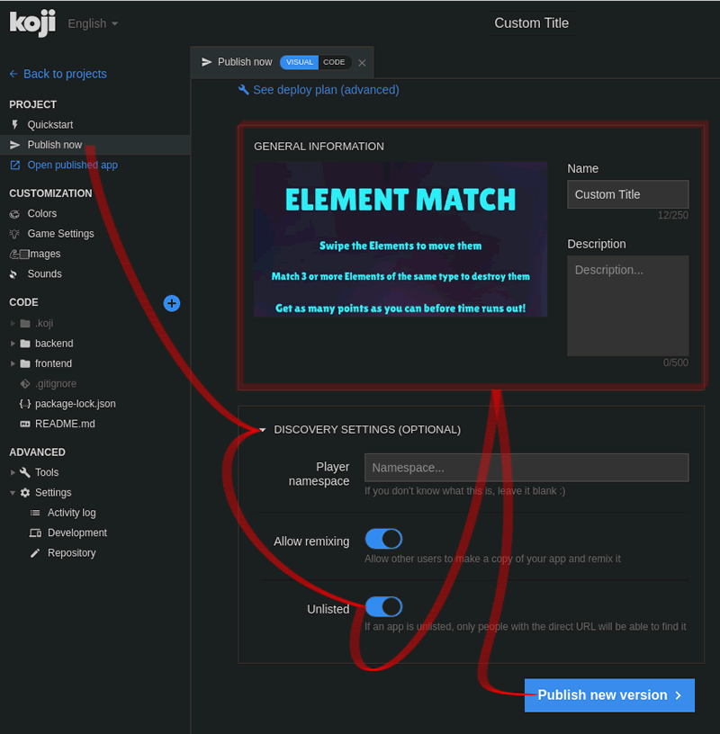
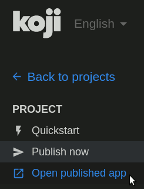

# Working Locally

Koji provides a feature-rich online project editor, but as a developer you are probably used to working with your own suite of development tools. In this tutorial, I will describe how to clone a Koji project template to your development machine, so that you can use it locally as the starting point for your own game.

## Required Tools

In order to develop your Koji project locally, you will need four tools:

1.  The open source **Git** version control system. Koji stores each template and each remixed project as a separate Git repository. To work on a project locally, you will need to use Git to download a clone of your project to your local hard-drive. You can then make changes and use Git to push the changes back to the `origin` repository on the Koji servers.  

    This tutorial assumes that you already have [Git](https://git-scm.com/downloads) installed on your computer, and that you are familiar with the basic Git commands. If you need to install Git on your computer, please do that first. You can find all the necessary information [here](https://git-scm.com/book/en/v2/Getting-Started-Installing-Git).
2.  The open source **Node.js** server environment. Koji uses Node.js and many add-on packages to deliver your web app to your users' browsers. You will need to [install Node.js](https://nodejs.org/en/download/) and its associated Node Package Manager (NPM) in order to run a Node server on your development computer.

3.  A Terminal application. You will be typing commands that use `git` and `npm` to set up your development environment. Depending on your operating system, the application you use will be different. Here are some suggestions:

    *   [Terminal](https://blog.teamtreehouse.com/introduction-to-the-mac-os-x-command-line) on macOS
    *   [GitBash](https://msysgit.github.io) on Windows
    *   [Linux Terminal](https://www.howtogeek.com/140679/beginner-geek-how-to-start-using-the-linux-terminal/) on Linux
4.  A text editor. This is where you will edit your code, and save it as plain-text files. A text editor that is designed for writing code will help you in many ways. Computers do exactly what you tell them to do, even if you tell them the wrong things. A dedicated text editor will make it easier for you to find the right words to use, and to find where you have used the wrong words or the wrong structure. You can find a list of recommended text editors [here](https://kinsta.com/blog/best-text-editors/), including several which are both excellent and free.

## Choosing a template for your project

You can find many game templates on the [Scaffolds (For Developers)](https://withkoji.com/tag/scaffolds-(for-developers)?sort=remixes) page. The instructions you find below should work well with any of them. For this tutorial, I am going to use Svarog's [Element Match](https://withkoji.com/~Svarog1389/element-match) template, because it features in the [How To](https://www.youtube.com/watch?v=R7FAL2IV0sk&feature=youtu.be) video tutorial, and it illustrates a completed game with code that runs both on the backend and on the frontend.

## Starting to Remix

Visit the [Element Match](https://withkoji.com/~Svarog1389/element-match) project and click on the `∞ Remix` button. Koji's Online Editor will open.

#### Signing in

If you are not signed in, you will be asked to sign in. If you are not yet registered, you will be asked to create an account.

#### Note

For the screen shots, I have used the energy-friendly Dark Koji theme. You can change the theme by clicking on your avatar at the top right, then on the cog icon, on the radio button for the theme you want, and finally on the Save button.

I use "KojiCoder" as the username for the project, but you should use the username you gave when you registered with Koji.

## Editor Overview

The Online Editor is divided into 4 sections:

1.  A column of Links on the left
2.  An editing pane which allows multiple open tabs in the center
3.  A Preview pane on the right
4.  A collapsible Terminal pane, with multiple tabs, at the bottom

At the top of the window, you will see an editable field with the default name of your new project: `Element Match (remix)`. This name will be used to create the URL to your game, so it is a good idea to change it to something that you will be proud of now.

## Cloning the Git Repository

When you click on Remix (for any project), Koji creates a new clone of the project's Git repository just for you. This new repository will have a unique identifier string. If you clone the same project twice, you will get a different identifier string each time. The Koji repositories are stored at https://projects.koji-cdn.com/.

In order to clone the Koji repository locally, you will need three strings:

*   The URL of the repository on https://projects.koji-cdn.com/
*   The Username that you created when you registered with Koji
*   An Access Token, which you will need to generate and store securely.

You will need to use the repository URL only once, you should know your Username by heart, but the Access Token is a 32-character randomly-generated hexadecimal number, and you will need to make a note of it in a safe place.

### Repository URL

To find the URL of the Koji repository, open your project page and in the bottom left corner of the page, click on the disclose triangle beside the Settings icon to see a link to your Repository settings. Click on that to open the Repository Settings pane.

The Repository Settings pane will show links to two repositories. The first is called Remote Repository, and this is your personal repository. (The second, called the Upstream Repository, is the one your project was cloned from. You can ignore this... or create a fork of it if you want to suggest changes and make Pull Requests for it, so that other users of this template can benefit.)

Copy the Remote Repository URL, open a Terminal window, navigate to the directory where you want to save your project and type `git clone` followed by a space, and then paste the repository URL that you just copied. Press the Enter key. Your Terminal window might now look something like this:

<pre class="terminal">~/Repos/Koji$ **git clone https://projects.koji-cdn.com/a70f8329-e89e-48b0-8d85-7658c1542b9f.git**
Cloning into 'a70f8329-e89e-48b0-8d85-7658c1542b9f'...
Username for 'https://projects.koji-cdn.com':
</pre>

The Terminal is asking for your Username, and after that it will ask for a Password. This password is **not** the same as the password you use to log in to Koji. It is a strong machine-generated access key, which only you should ever know about.

### Access Key

To generate an Access Key, you need to visit the [Access key](https://withkoji.com/settings/access-keys) pane in your Settings page. There are two ways to find your Settings page:

1.  From your [Home page](https://withkoji.com/), press the Settings button at the bottom left
2.  From any page, press your avatar in the top right corner, and then on the Cog icon, as shown in the screenshot below.

When you are on your Settings page, press the [Access keys](https://withkoji.com/settings/access-keys) link in the column on the left.

On the Access Key page, click on the Generate New Token link at the top right.

An overlay window will open containing a 128-bit number in hexadecimal form. Copy this number and keep it somewhere safe, where only you can find it easily. You will need to use it each time you clone, pull or push to the `origin` repository.

After you close the overlay window, this number will be known only as `Token 1`, and you will have no way to retrieve it from the Koji site again. You can, however, revoke your token and generate a new one if you have forgotten it, or if you believe that someone unauthorized has discovered it.

### Username

Your username for the Koji Git repository is the same as the name you chose when you registered with Koji. For reference, it is shown at the bottom of the paragraph above your list of tokens.

### Authorizing Git to Clone the Repository

In the Terminal window, type in your Username, then press the Enter key. When asked for the password, paste in the 32-character hex string that you copied from the Access Key overlay window. (Remember than in some Terminal windows, `Ctrl-C` means "Cancel", so you may have to use `Shift-Ctrl-C` to paste). The password that you pasted will not be shown. Press the Enter key to start the cloning process.

<pre class="terminal">~/Repos/Koji$ git clone https://projects.koji-cdn.com/a70f8329-e89e-48b0-8d85-7658c1542b9f.git
Cloning into 'a70f8329-e89e-48b0-8d85-7658c1542b9f'...
**Username for 'https://projects.koji-cdn.com': KojiCoder
Password for 'https://KojiCoder@projects.koji-cdn.com':** 
remote: Counting objects: 15941, done.
remote: Compressing objects: 100% (6156/6156), done.
remote: Total 15941 (delta 9517), reused 15941 (delta 9517)
Receiving objects: 100% (15941/15941), 9.35 MiB | 754.00 KiB/s, done.
Resolving deltas: 100% (9517/9517), done.
Checking connectivity... done.
</pre>

## What You Get

You should now have a new directory with a beautifully arcane name like `a70f8329-e89e-48b0-8d85-7658c1542b9f`. For the rest of this tutorial, I'm going to imagine that you renamed it to `MyKojiGame`:

<pre class="terminal">~/Repos/Koji$ **mv a70f8329-e89e-48b0-8d85-7658c1542b9f/ MyKojiGame**
</pre>

Now you can `cd` into your `MyKojiGame` directory, and look at what has been cloned in:

<pre class="terminal">~/Repos/Koji$ **cd MyKojiGame/**
~/Repos/Koji$ **ls -al**
total 40
drwxrwxr-x  6 kojicoder dev 4096 nov  5 16:38 .
drwxrwxr-x 11 kojicoder dev 4096 nov  5 17:00 ..
drwxrwxr-x  3 kojicoder dev 4096 nov  5 16:38 backend
-rw-rw-r--  1 kojicoder dev  516 nov  5 16:38 Dockerfile
drwxrwxr-x  5 kojicoder dev 4096 nov  5 16:38 frontend
drwxrwxr-x  8 kojicoder dev 4096 nov  5 16:38 .git
-rw-rw-r--  1 kojicoder dev  186 nov  5 16:38 .gitignore
drwxrwxr-x  6 kojicoder dev 4096 nov  5 16:38 .koji
-rw-rw-r--  1 kojicoder dev   27 nov  5 16:38 package-lock.json
-rw-rw-r--  1 kojicoder dev  797 nov  5 16:38 README.md
</pre>

## Installing the Dependencies

The clone process installed all the project-specific files, but it only contains information about the servers and other dependencies that you will need to launch the game locally, but not the dependency files themselves. Before you can test the game on your development machine, you will need to install two sets of Node modules, one set to run the frontend and another set to run the backend.

To deal with the backend, `cd` to the `backend` director and run `npm install`. You'll have to wait for a minute or two while the Terminal window shows you what's happening.

<pre class="terminal">~/Repos/Koji/MyKojiGame$ **cd backend**
~/Repos/Koji/MyKojiGame/backend$ **npm install**

> core-js@2.6.9 postinstall /home/kojicoder/Repos/Koji/MyKojiGame/backend/node_modules/core-js
> node scripts/postinstall || echo "ignore"

npm WARN koji-project-backend@1.0.0 No description
npm WARN koji-project-backend@1.0.0 No repository field.
... (more warnings and comments not shown) ...

added 477 packages from 234 contributors and audited 8550 packages in 6.678s
found 0 vulnerabilities
</pre>

Dealing with the frontend is similar: `cd` to the `frontend` director and run `npm install`:

<pre class="terminal">~/Repos/Koji/MyKojiGame$ **cd ../frontend/**
~/Repos/Koji/MyKojiGame/frontend$ **npm install**

> koji-tools@0.5.3 postinstall /home/kojicoder/Repos/Koji/MyKojiGame/frontend/node_modules/koji-tools
> node ./cmd.js postinstall

new config

> preact@8.5.1 postinstall /home/kojicoder/Repos/Koji/MyKojiGame/frontend/node_modules/preact

> webpack-cli@3.3.1 postinstall /home/blackslate/Repos/Koji/MyKojiGame/frontend/node_modules/webpack-cli
> node ./bin/opencollective.js

npm WARN meta-project@1.0.0 No repository field.
npm WARN meta-project@1.0.0 No license field.
... (more warnings and comments not shown) ...

added 996 packages from 358 contributors and audited 12188 packages in 14.023s
found 345 vulnerabilities (1 low, 344 high)
  run `npm audit fix` to fix them, or `npm audit` for details
</pre>

#### Optional Audit

If you want to update all the Node modules to their most recent stable release, you can run `npm audit fix`.

<pre class="terminal">~/Repos/Koji/MyKojiGame/frontend$ **npm audit fix**
npm WARN meta-project@1.0.0 No repository field.
npm WARN meta-project@1.0.0 No license field.
... (more warnings and comments not shown) ...

removed 2 packages and updated 4 packages in 7.468s
fixed 344 of 345 vulnerabilities in 12188 scanned packages
  1 vulnerability required manual review and could not be updated
</pre>

This will alter the `package-lock.json` file, so that it can request the identical file versions if you run `npm install` on a different computer.

## Launching Your Project Locally

The Element Match game features both a frontend – so that you can play the game in your browser – and a backend – to access a database where the Leaderboard scores are stored.

#### Games With No Leaderboard

If you chose to develop a game that does **not** require a leaderboard, then launching your project locally is very simple. Simply `cd` to the `frontend` directory and run `npm start`:

<pre class="terminal">$ **cd ../frontend/**
$ **npm start**

... (some output not shown) ...
ℹ ｢wds｣: Project is running at [http://0.0.0.0:8080/](http://0.0.0.0:8080)
ℹ ｢wds｣: webpack output is served from /
... (more output not shown) ...

ℹ ｢wds｣: Compiled successfully
</pre>

You should now be able to visit [http://0.0.0.0:8080](http://0.0.0.0:8080) in your browser to test your project. Note that [http://localhost:8080/](http://localhost:8080/) and [http://127.0.0.1:8080/](http://127.0.0.1:8080/) might also work.

### Environment variables

If you want to run the Leaderboard, the procedure for launching your game is more complex. You will need to inform the frontend which URL to use to connect to the backend, and you will need to give the backend a couple of details concerning your project. And you will have to launch both the frontend and the backend servers on your local machine, using separate Terminal windows for each.

The Koji system reads in these items of information from [environment variables](https://en.wikipedia.org/wiki/Environment_variable). This ensures the data that is specific to deployment is kept separate from the code and configuration that is specific to your app.

To see what environment variables Koji uses to deploy your project, go to the Online Editor for your project, open a new Terminal tab at the foot the page and type:

    env | grep 'KOJI_'

Below is the output that I get, edited to show only the relevant items. The values that you will see in your output will be unique to your project.

<pre class="koji">root@ip-172-31-15-24:/usr/src/app# **env | grep 'KOJI_'**
...
KOJI_SERVICE_URL_backend=https://3333-48006672-6558-4f69-a40c-e4142c15067f.koji-staging.com

... (some variables not shown) ...

**KOJI_PROJECT_ID=a70f8329-e89e-48b0-8d85-7658c1542b9f
KOJI_PROJECT_TOKEN=6679483a-dab8-4e89-9a83-6b56b53b4241**
...
</pre>

### Launching the frontend

The backend is configured by default to run on port `3333`, while the frontend is configured to run at [http://0.0.0.0:8080](http://0.0.0.0:8080). When you launch the frontend, you need to tell it which URL it needs to use to access the backend. On Mac OS and other Unix-based operating systems, you can use the `export` command to do this.

Navigate to the `frontend` directory for your project, and then set the `KOJI_SERVICE_URL_backend` environment variable just before you call `npm start`. Your Terminal window might look something like this:

<pre class="terminal">$ **cd ..frontend/**
$ **export KOJI_SERVICE_URL_backend=http://0.0.0.0:3333 && npm start**

... (some output not shown) ...
ℹ ｢wds｣: Project is running at http://0.0.0.0:8080/
ℹ ｢wds｣: webpack output is served from /
... (more output not shown) ...

ℹ ｢wds｣: Compiled successfully
</pre>

### Launching the backend

The backend needs to have both a `KOJI_PROJECT_ID` and a `KOJI_PROJECT_TOKEN` in order to access the Leaderboard database. You can get the value of these variables from the Terminal tab in the Online Editor for your project. Type...

`env | grep 'KOJI_PROJECT_'`

... and copy the output that you get.

**Open a new Terminal window**, and navigate to the `backend` directory of your project. Now set these two variables just before you call `npm run start-dev`. Your Terminal window might look something like this:

<pre class="terminal">$ **cd ../backend/**
$ **export KOJI_PROJECT_ID=a70f8329-e89e-48b0-8d85-7658c1542b9f && export
KOJI_PROJECT_TOKEN=6679483a-dab8-4e89-9a83-6b56b53b4241 && npm run start-dev**

> koji-project-backend@1.0.0 start-dev /home/kojicoder/Repos/Koji/Element Match/39ff/backend
> NODE_ENV=development babel-watch -L --watch ../.koji/ src/server.js

[koji] backend started
</pre>

Remember to use your own values in the place of the values shown in italics above.

## Testing Your Local Deployment

Check that the frontend reported `Compiled successfully` and that the backend reported `backend started`,. If you see errors, make sure that you have no other apps already running on port `8080` or port `3333`.

Now, in your browser, visit [http:0.0.0.0:8080](http:0.0.0.0:8080). You should see the Element Match game running.

Click on the Leaderboard button, to check that it is working. If you haven't played the game yet, there will be no scores to show, but you will still see the title "Top Scores" and a Close link that returns you to the Welcome screen.

Click on Start Matching, and start scoring points. When the game is over, you will be invited to submit your user name. This time, the Leaderboard should show your name and your score.

## Smoke Test

Now you have a template project running on your local computer, so you can use your own favourite text editor to modify it and add new features. You will also be able to test that these new features work on your development machine. However, in order to share your project with the world, you need to get your updated project running on the Koji servers.

Before you get deep into development locally, it would be a good idea to make just one minor change, push it back to the Koji servers, and check that the change is visible to the world.

### Changing a Visual Customization Control

The simplest change that will be the most immediately obvious is the title of the game. To change this in the Online Editor, the easiest way is to click on the Customization > Game Settings link in the column on the left. This will open the Game Settings editor in Visual Mode. This is the way the non-coding _makers_ will customize your game when you have finished developing it.

However, Visual Mode is not available when you are developing your project locally. You will need to open the file at `.koji/customization/string.json` in your favorite text editor, and make the change there:

<pre class="editor">
{
  "strings": {
    "fontFamily": "https://fonts.googleapis.com/css?family=Lilita+One",
    "title": "CUSTOM TITLE",
    "instructions1": "Swipe the Elements to move them",
    ... (more json code here) ...

</pre>

Save your file with your new title, then in your browser at [http://0.0.0.0:8080](http://0.0.0.0:8080), check that the splash screen now shows the new title.

## From Local to Live

Making this change visible on Koji server is a four-step process.

1.  Tell Git to `commit` your changes locally
2.  Tell Git to `push` the committed changes to the remote Koji repository
3.  Tell the instance of Git in Koji's Online Editor to `pull` the commited changes from the Koji repository
4.  Tell the Koji Editor to Publish the updated version of your game.

### Tracking Changes with Git

Each time you make a change to one of the files in your project, the Git version control system will note that the file has changed. You can use the command `git status` to discover which files have changed.

#### Note

At the root of your project, there is a file called `.gitignore`. (You might not see it because, by default, files whose names begin with a dot are hidden by your operating system.)

The `.gitignore` file tells Git which files and folders to ignore. In particular, this file tells Git to ignore any changes made to files in the `node_modules` folders. These are the folders that were created when you ran `npm install` from within the `frontend/` and `backend/` folders. However, if you make a change to any file that is not an a `node_modules` folder, Git will be aware of your changes.

When you are ready to test your changes on the Koji server, open a Terminal window into the root directory of your project (`MyKojiGame/`, in my case) and run the following commands:

<pre class="terminal">$ **git add .                      ** # tells Git to process all the documents that you have changed
$ **git commit -m "(your comments)"** # tells Git to create an updated version of your project
</pre>

Note that you should replace `(your comments)` with a brief description of the changes that you have made, so that you will be able to remember what features you were working on.

#### Understanding Git `commit`

You can find a more complete description of the commands `git add` and `git commit` commands [here](https://www.atlassian.com/git/tutorials/saving-changes).
### Pushing Changes to the Koji Repository

After the `commit` process is successfully completed, you can use Git to upload the changes you have made to the repository stored on the Koji servers. To do this, you need to use the command `git push origin master`. You will be asked for your Koji username, and for your password. Your password is the Access Key that you created earlier and stored somewhere safely.

<pre class="terminal">$ **git push origin master** # tells Git to upload your new version to the Koji repository
Counting objects: 21, done.
Delta compression using up to 4 threads.
Compressing objects: 100% (21/21), done.
Writing objects: 100% (21/21), 84.53 KiB | 0 bytes/s, done.
Total 21 (delta 15), reused 0 (delta 0)
**Username for 'https://projects.koji-cdn.com': KojiCoder
Password for 'https://blackslate@projects.koji-cdn.com':** Paste your 32-character Access Key here
To https://projects.koji-cdn.com/a70f8329-e89e-48b0-8d85-7658c1542b9f.git
   a88036c..ea6bda1  master -> master
</pre>

## Testing Your Updated App on the Koji Server

If you test your game in the Online Editor on the Koji Server now, you will not see any changes. This is because the Online Editor uses its own repository, which is different from the `origin` repository that you have just pushed your changes to. In order to update the repository used by the Online Editor, you will need to `pull` them from the `origin` repository.

To do this, you can use the command `git pull origin master`.

<pre class="koji">root@ip-172-31-12-226:/usr/src/app# **git pull origin master**
remote: Counting objects: 21, done.
remote: Compressing objects: 100% (21/21), done.
remote: Total 21 (delta 15), reused 0 (delta 0)
Unpacking objects: 100% (21/21), done.
From https://projects.koji-cdn.com/a70f8329-e89e-48b0-8d85-7658c1542b9f
 * branch            master     -> FETCH_HEAD
   a88036c..ea6bda1  master     -> origin/master
Updating a88036c..ea6bda1
Fast-forward
 backend/package-lock.json        | 41 ++++++++++++++++++++++++++++++-----------
 frontend/package-lock.json       | 82 +++++++++++++++++++++++++++++++++++++++++++++++++++++++++++++---------------------
 .koji/customization/strings.json |  2 +-
 3 files changed, 92 insertions(+), 33 deletions(-)
</pre>

### Previewing Your Modified App

The code in the Online Editor should now be identical to the code in your local repository. In the Online Editor, in the Preview pane on the right, you should now see your custom title, corresponding to the change you made in `.koji/customization/strings.json`.

### Updating the Node Modules

Your Git repository does not store any of the files in the `node_modules` directory, and indeed, the Online Editor does not even display this folder. However, if you ran `npm audit fix` earlier, the `package.json` and `[package-lock.json](https://medium.com/coinmonks/everything-you-wanted-to-know-about-package-lock-json-b81911aa8ab8)` files in both the `backend` and the `frontend` directories may have changed, so you do at least have the information that you need to update your node modules to their most recent version. To benefit from this, you'll need to run `npm install` for both the `frontend` and the `backend` in the Terminal pane of the Online Editor.

1.  Click on the `frontend` tab of the Terminal pane
2.  Press `Ctrl-C` on your keyboard to halt the frontend server
3.  Run `npm install`
4.  Wait for the newest version of each module to be installed, then run `npm start`

<pre class="koji">**^C**
root@ip-172-31-15-216:/usr/src/app/frontend# **npm install**
npm WARN meta-project@1.0.0 No repository field.
npm WARN meta-project@1.0.0 No license field.
... (more warnings and comments not shown) ...

audited 12334 packages in 5.192s
found 1 low severity vulnerability
  run `npm audit fix` to fix them, or `npm audit` for details
root@ip-172-31-15-216:/usr/src/app/frontend# **npm start**
... (more output not shown) ...

ℹ ｢wds｣: Compiled successfully
</pre>

1.  Click on the `backend` tab of the Terminal pane
2.  Press `Ctrl-C` on your keyboard to halt the backend server
3.  Run `npm install`
4.  Wait for any new modules to be installed, then run `npm run start-dev`

<pre class="koji">**^C**
root@ip-172-31-15-216:/usr/src/app/backend# **npm install**
npm WARN koji-project-backend@1.0.0 No description
npm WARN koji-project-backend@1.0.0 No repository field.
... (more warnings and comments not shown) ...

audited 8550 packages in 2.729s
found 0 vulnerabilities

root@ip-172-31-15-216:/usr/src/app/backend# **npm run start-dev**
... (more output not shown) ...

[koji] backend started
</pre>

### Publishing Your New Version

To complete the first iteration cycle of your new project, you now need to publish it, so that you can test how it behaves when served live from the Koji servers. You have only just started development, so you probably don't want its existence broadcast to the whole of the World Wide Web quite yet. For now, being able to test your game live yourself, or with feedback from a small hand-picked group, is good enough. Fortunately, Koji gives you a way to publish your project _unlisted_. This means that only people who obtain the direct URL will be able to visit your published app.

In the Online Editor:

1.  Click on the Publish Now link near the top of the left-hand column.
2.  Open the Discovery Settings (Optional) disclose triangle, near the middle of the page, to show more options
3.  Ensure that the Unlisted checkbox is selected
4.  Make any other changes that you want in the General Information Zone
5.  Click on Publish New Version.

You will have to wait a few moments while your project is published, then you will be able to click on the Open Published App link near the top of the left-hand column, to test your game live.

#### Getting Listed

By default, from now on, each time you publish your project, it will be published _unlisted_. When your project is ready for the world to see, don't forget to remove this setting.

#### Tip: Using a Separate Koji Project to Edit VCC Files Online

The Online Editor provides two features that are not available in your local development environment:

*   A Visual Mode to edit the JSON files stored at `.koji/customization/`
*   The ability to generate custom URLs for customizable assets

If you edit the JSON files stored at `.koji/customization/` in your local development environment, you risk creating valid JSON that nonetheless fails to conform to the expectations of the Online Editor. In particular, the `"@@editor"` array needs to contain specific property-value pairs and precisely constructed objects, otherwise the Visual Mode will fail to work, and makers will not be able to customize your game correctly. In order to ensure that your changes to the `"@@editor"` array are valid, it makes sense to work in the Online Editor, and to toggle back and forth between the Visual and Code modes, checking as you go that the Visual Mode works the way you expect it to.

Another reason for using the VCC editor online in Visual Mode is that you can upload images and audio files, or provide a direct URL to where these files can be found online, and the Koji system will copy them to the Koji CDN servers and insert the appropriate URL into the associated JSON file for you. Working in your local development environment, there is no way for you to transfer files to the Koji servers and to obtain their URLs.

But there is a down side to this. If you edited these customization JSON files in the Online Editor or used the Online Editor in Visual Mode to link to different assets, then you would need to manually `push` the changes to Koji's `origin` repository and then `pull` them into your local development environment. And if you had also made local changes since your last local commit, this might result in conflicts between the Online Editor's repository and your local Git repository.

In other words, in either of these two cases, editing the JSON files stored at `.koji/customization/` could lead to problems. Editing in the Online Editor could lead to one kind of problem, and editing locally could lead to another.

Fortunately, there is a simple solution:

1.  Create a separate Koji project _specifically for editing VCC JSON files, and nothing else_
2.  For each of the JSON files stored in the `.koji/customization/` folder of this separate project, edit the `"@@editor"` array until the Visual Mode works the way you want it
3.  Use the customized Visual Mode in this separate project to set the VCC values that you want in your main project
4.  When you have all the customized values you need in the Online Editor, switch to Code Mode and copy the entire JSON content
5.  In your local development environment, paste this tried and tested VCC code into the appropriate JSON file
6.  Commit your changes locally, push to the Koji `origin` repository, and pull the changes into the the Online Editor of your main project.

This way, you can be sure your modified code always flows only in one direction: _from_ your local development environment _to_ the online Koji environment.

The separate Koji project that you use for editing and testing the VCC JSON files can be reduced to its bare bones, if you want. You can delete all the frontend and backend code, and retain just the `.koji` directory and its contents. You can use the same `.koji` directory to store all the VCC JSON files for all your projects. It's just a container that lets you take advantage of the online-only Visual Mode.

## Conclusion

This tutorial has taken you on a round trip from the Koji Online Editor to your local development environment and back again. You have seen changes that you made locally served live from the Koji servers.

As you develop your project, you will cycle through many such loops, adding and refining features and testing that everything works just as beautifully when delivered from the Koji servers as from the comfort of your own development machine.

In particular, you have seen how to:

*   Find the required tools: Git, Node.js, a Terminal application and a text editor
*   Clone the Git repository for your project onto your local machine
*   Find the username and password that allows you to interact with Koji's `origin` repository
*   Install the Node modules that are needed to run a server on your local machine
*   Make and test changes locally
*   Push your changes to the `origin` repository, and then pull them into the Online Editor
*   Publish your changes to the Koji server
*   Test that your game behaves the same live on a Koji server as it does locally
*   Take full advantage of the Visual Mode for the JSON customization files, so that makers will have an easy job of making their own versions of your game.

You're now ready to start developing your Koji game in earnest, in the development environment where you feel most comfortable. Let's see your creativity shine!